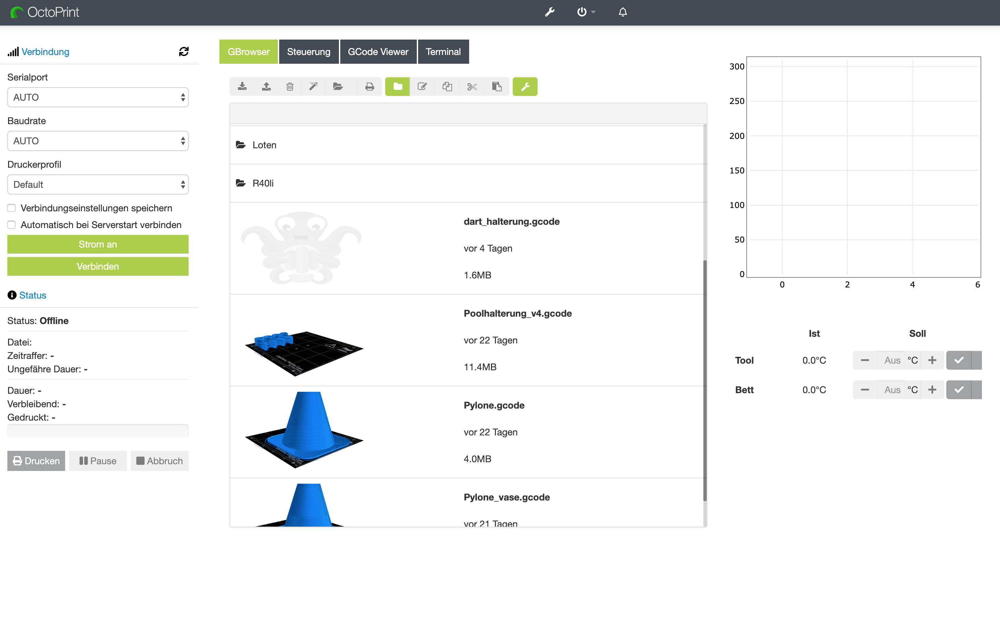

# octostyle


injected js and css into octoprint source for manual styling


##
install "Navbar Temperature Plugin (0.xx)"

edit file : /home/octoprint/OctoPrint/src/octoprint/templates/index.jinja2

add following before 

```
</header>
```

and paste:

```
        <script type="text/javascript" src="http://192.168.120.244:88/jquery.js"></script>
        <link href="http://192.168.120.244:88/custom.css" rel="stylesheet">
        <script src="http://192.168.120.244:88/custom.js" type="text/javascript"></script>
```

next: compile and serve


## Screenshot


